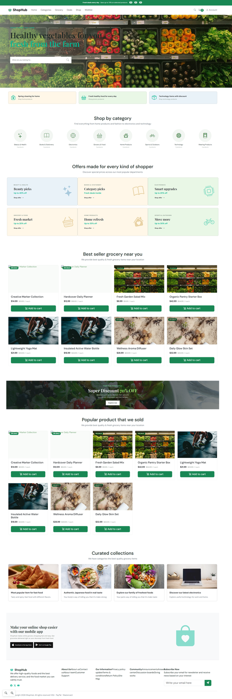
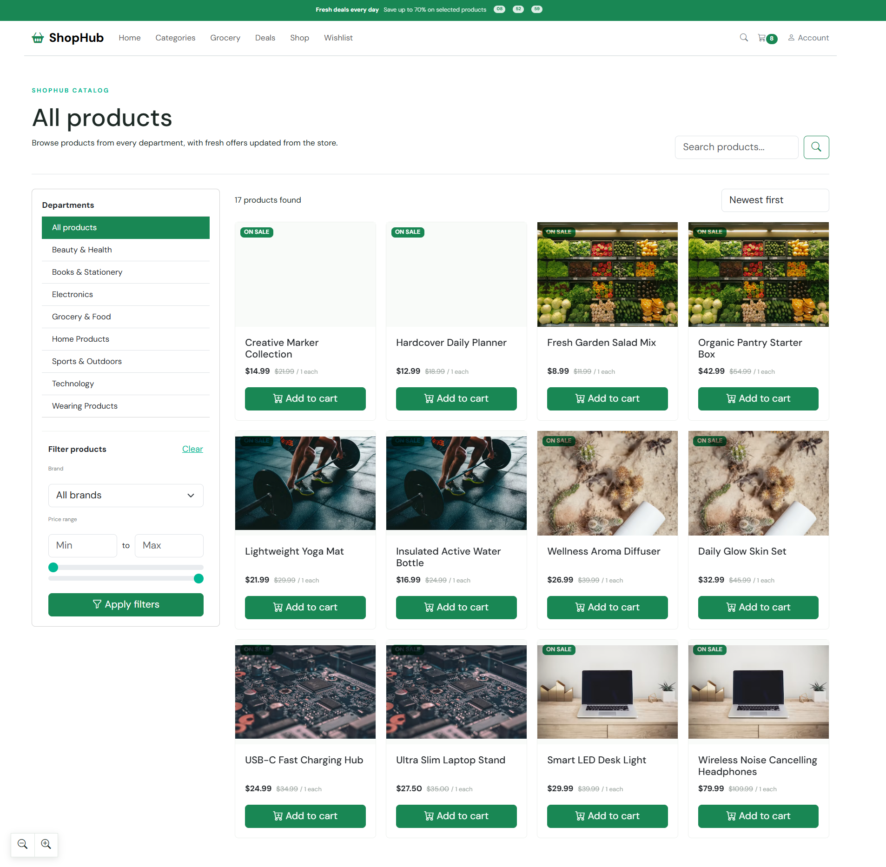
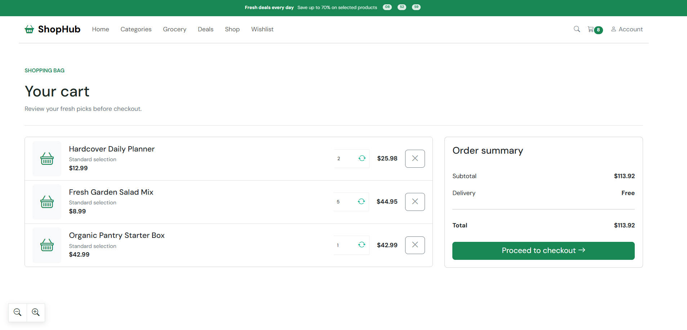
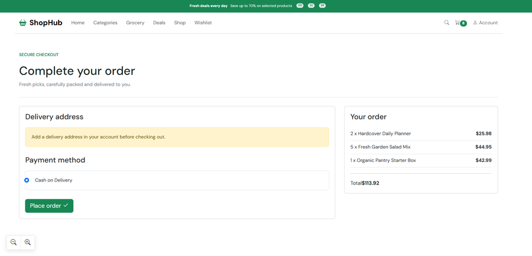
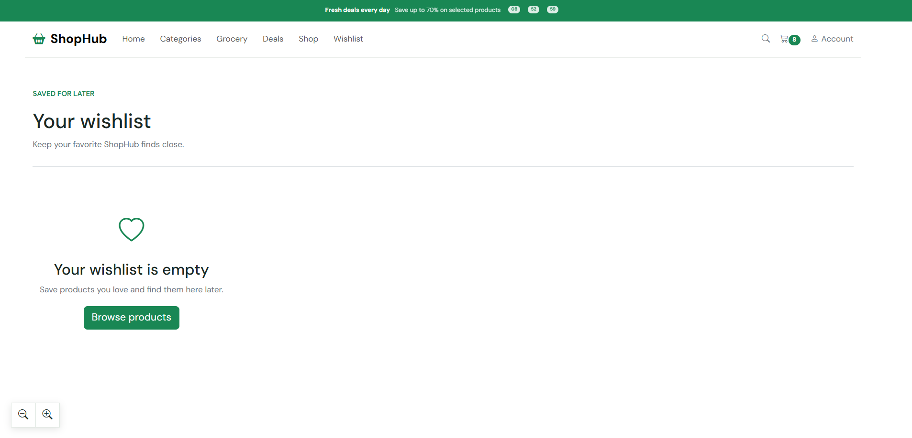
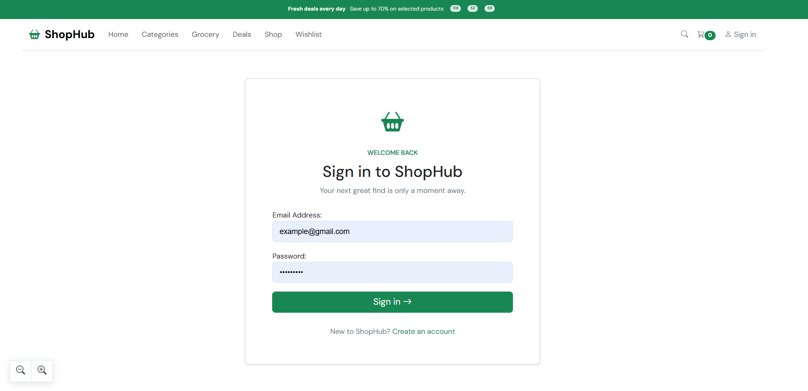
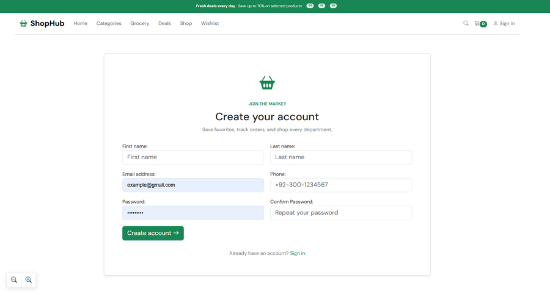
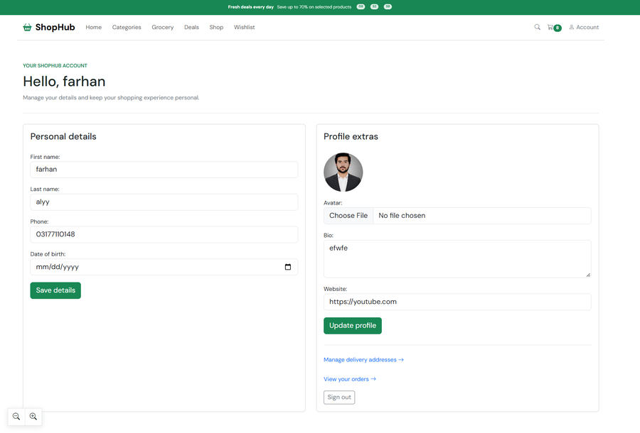

# ShopHub

ShopHub is a Django-based e-commerce platform with product browsing, user accounts, shopping cart, coupons, orders, reviews, wishlist, notifications, and an admin dashboard.

## Screenshots

### Home

### Products

### Cart

### Checkout

### Wishlist

### Login

### Register

### Profile

